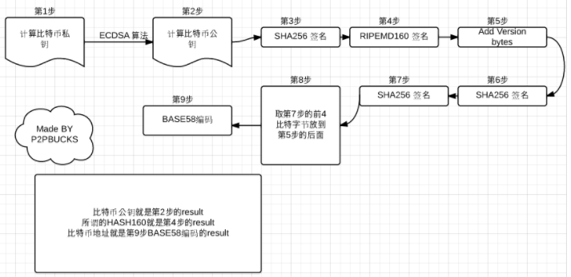

比特币地址生成算法

比特币地址生成流程如下图所示：

1. 第一步：选择私钥

   在一个限定范围内随机选择一个数。第一，私钥必须是32个字节，也就是说是32乘以8位的二进制数。实际使用中，私钥可以表示为二进制格式、八进制格式、Base64格式、WIF格式或者助记词格式。不管什么样的格式，底层都对应相同的256位二进制数。

2. 第二步：计算公钥

   通过ECDSA算法生成公钥。私钥传入ECDSA算法得到64字节的整数（由长度均为32字节的一个点的 X 值和 Y 值拼接到一起得到的）。在结果的最开头加上0x04，就是完整公钥。压缩之后就是压缩公钥

3. 第三步：生成地址

   公钥经过一系列的转换生成地址

   step1-SHA-256签名

   step2-RIPEMD-160加密

   step3-头部添加网络版本号。主网0x00

   step4-SHA-256签名

   step5-SHA-256签名

   step6-取step5的前四字节放在step3后面

   step7-Base58编码

背景知识

